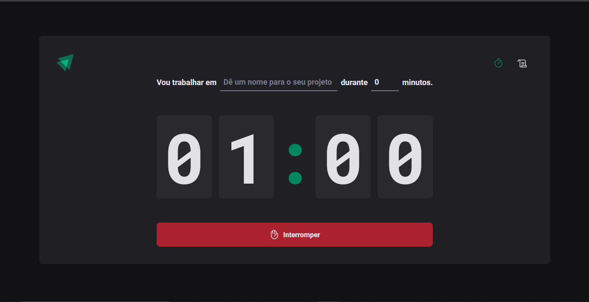
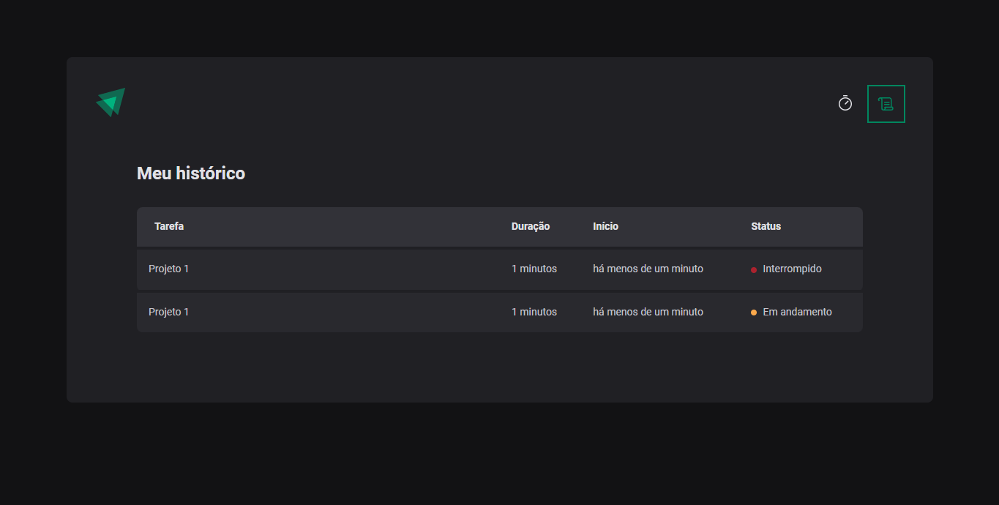

<h1 align="center">
	Ignite Timer
</h1>

<h3 align="center">
	Timer para projetos
</h3>

<p align="center">
	
	
	
</p>

<h4 align="center">
	Status: 🚀 Finished
</h4>

<p align="center">
	<a href="#about">About</a> •
	<a href="#tech-stack">Tech Stack</a> •
	<a href="#installation">Installation</a> •
	<a href="#usage">Usage</a> • 
	<a href="#contact">Contact</a> 
</p>

## About
O ignite timer funciona como um timer, para você calcular suas tarefas, com um historico de tarefas feitas, é o tempo que você levou para fazer.

## Tech Stack
&nbsp;
&nbsp;

<div style="display:flex"> 
    &nbsp;
    &nbsp;
</div>

## Installation
To Install this project, follow the steps above:
```bash
git clone https://github.com/Vander-Reis/ignite-timer
```

## Usage
To use this project, follow the steps above:
```bash
npm install

npm run dev
```

## Contact


Made with ❤️ by [Vander Reis](https://github.com/Vander-Reis), get in touch!

<a href="mailto:vanderreis2017@outlook.com" target="_blank"></a>&nbsp;
<a href="https://www.linkedin.com/in/vander-reis-044163201/" target="_blank"></a>&nbsp;

<br clear="left"/>
